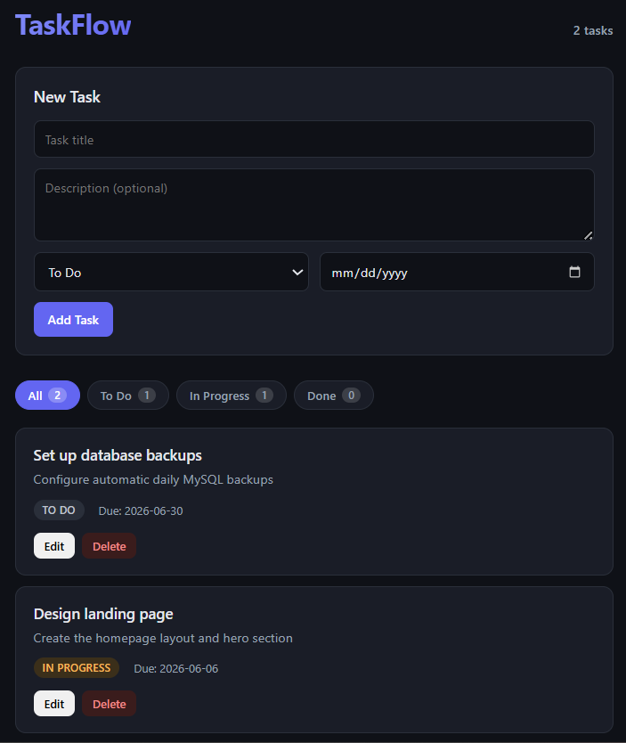

# TaskFlow — Laravel + React Task Manager

A simple, full-stack task management application. The backend is a Laravel 11 REST API; the frontend is a React (Vite) single-page app that consumes it. Tasks are stored in MySQL and support full CRUD with status filtering.



## Features

- Create, read, update, and delete tasks
- Task fields: title, description, status (`todo`, `in_progress`, `done`), and due date
- Filter tasks by status with live counts (All / To Do / In Progress / Done)
- Total task count in the header
- Clean, responsive dark UI
- Loading and error states for a smoother experience

## Tech Stack

**Backend**
- Laravel 11
- MySQL
- REST API (no authentication)

**Frontend**
- React (Vite)
- Axios for HTTP requests
- Plain CSS (dark theme)


## Project Structure

```
task-manager-app/
├── backend/      # Laravel 11 REST API
├── frontend/     # React (Vite) app
└── screenshots/  # README images
```

## Getting Started

### Prerequisites

- PHP 8.2+ and Composer
- Node.js 18+ and npm
- MySQL

### 1. Backend (Laravel)

```bash
cd backend

# Install PHP dependencies
composer install

# Copy the environment file and generate an app key
cp .env.example .env
php artisan key:generate
```

Edit `.env` and set your database credentials:

```env
DB_CONNECTION=mysql
DB_HOST=127.0.0.1
DB_PORT=3306
DB_DATABASE=taskflow
DB_USERNAME=root
DB_PASSWORD=your_password
```

Create the database (in MySQL):

```sql
CREATE DATABASE taskflow CHARACTER SET utf8mb4 COLLATE utf8mb4_unicode_ci;
```

Run the migrations and start the server:

```bash
php artisan migrate
php artisan serve
```

The API runs at `http://127.0.0.1:8000`.

### 2. Frontend (React)

In a second terminal:

```bash
cd frontend

# Install dependencies
npm install

# Start the dev server
npm run dev
```

The app runs at `http://localhost:5173`.

> Make sure the backend is running before opening the frontend, otherwise tasks won't load.

## API Endpoints

| Method | Endpoint            | Description          |
| ------ | ------------------- | -------------------- |
| GET    | `/api/tasks`        | List all tasks       |
| POST   | `/api/tasks`        | Create a new task    |
| GET    | `/api/tasks/{id}`   | Get a single task    |
| PUT    | `/api/tasks/{id}`   | Update a task        |
| DELETE | `/api/tasks/{id}`   | Delete a task        |

### Task fields

| Field         | Type   | Notes                                       |
| ------------- | ------ | ------------------------------------------- |
| `title`       | string | Required                                    |
| `description` | text   | Optional                                    |
| `status`      | enum   | `todo`, `in_progress`, or `done`            |
| `due_date`    | date   | Optional                                    |

## License

This project is open source and free to use for learning purposes.
